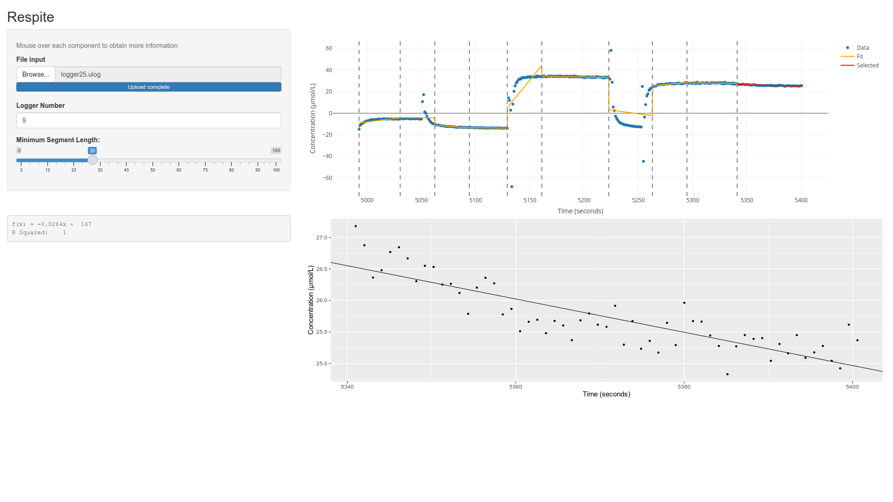

# Respite
An R shiny web app for streamlining respiromentry analysis in R.
*Respite* loads raw respirometry data, automatically segments it, and allows you to select a stable segment from which produce a trend plot and equation.



## Motivation

Manual rate analysis  can be done in Excel, but is time consuming, as you have to follow all of these steps:

* Export from the electrode software as a CSV
* Import the CSV into Excel
* Select a stable range of points, somewhat arbitrarily
* From these, create a trend plot
* Extract the trend line from the plot

*Respite* automates all these steps, and increases the reproducibility of the method, as it requires of less guesswork.

Alternatively, there exists software for analysing this data. 
For example, [`respR`](https://github.com/januarharianto/respR) is a promising R package that provides many helpful utilities.
However, using such a package still has the barrier of needing to write R code, while *Respite* provides a user-friendly web interface.
In addition, `respR` requires the user to manually determine segments of the data (ie peaks), whereas *Respite* does this automatically.

## Usage

Most users will be able to access the application at <https://multimeric.shinyapps.io/Respite/>.
The application itself contains help that explains how to use it, but if you have any further questions please create an issue at <https://github.com/GreeningLab/Respite/issues>.
If this server is overloaded or you want to make manual adjustments, please read on to the next section.

## Local Installation
In the terminal (e.g. bash):
```bash
git clone https://github.com/GreeningLab/Respite.git
cd Respite
```

Then, in an R console:
```R
# Install dependencies
install.packages('renv')
renv::restore()

# Run application
shiny::runApp()
```

## Contributing
Respite still has many possible extensions.
In particular, it only supports `.ulog` logging files.
If you would like to contribute a new logging parser, please file an issue at <https://github.com/GreeningLab/Respite/issues> and we can discuss how this might be done.

## Acknowledgements

Thank you particularly to [Associate Professor Rebecca Killick](https://www.lancs.ac.uk/~killick/), whose `changepoint` and `EnvCpt` packages this relies heavily on.